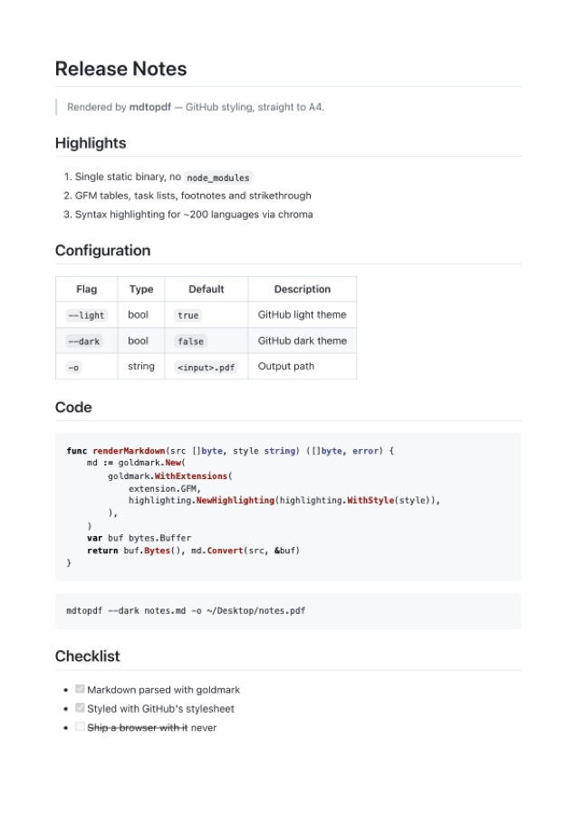
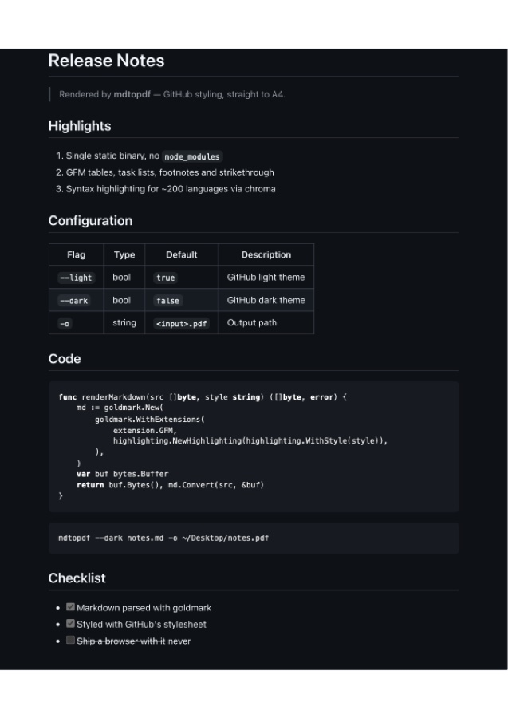

<div align="center">


<h1>mdtopdf</h1>

<p><strong>Markdown → PDF with GitHub styling.</strong><br>
One static Go binary. No <code>node_modules</code>, no LaTeX, no Docker.</p>

<p>
  <a href="https://github.com/artschekoff/mdtopdf/releases"></a>
  
  
  <a href="LICENSE"></a>
</p>

</div>

---

## What it does

```sh
mdtopdf notes.md          # → notes.pdf
mdtopdf --dark notes.md   # → the same, GitHub dark
```

That's the whole tool. It parses Markdown with [goldmark](https://github.com/yuin/goldmark)
(full GFM: tables, task lists, strikethrough, autolinks), highlights code with
[chroma](https://github.com/alecthomas/chroma), wraps it in GitHub's stylesheet —
compiled into the binary, no files to ship alongside — and prints it to A4
through the Chrome you already have installed, driven by
[chromedp](https://github.com/chromedp/chromedp).

Nothing is uploaded anywhere. Chrome runs headless, locally, for a fraction of a second.

## Output

<table>
<tr>
<td width="50%"></td>
<td width="50%"></td>
</tr>
<tr>
<td align="center"><code>mdtopdf sample.md</code></td>
<td align="center"><code>mdtopdf --dark sample.md</code></td>
</tr>
</table>

Both pages are real output — that's [`testdata/sample.md`](testdata/sample.md) run through the binary.

## Install

```sh
git clone https://github.com/artschekoff/mdtopdf
cd mdtopdf
make install                        # → ~/.local/bin/mdtopdf
make install PREFIX=/usr/local/bin  # somewhere else
```

Or grab a binary from [Releases](https://github.com/artschekoff/mdtopdf/releases).

**Requirements:** Go 1.22+ to build, and Google Chrome or Chromium at runtime.
chromedp finds the browser automatically in the usual places.

## Usage

```
mdtopdf [--light|--dark] [-o out.pdf] <file.md>
```

| Flag | Description |
|------|-------------|
| `--light` | GitHub light theme *(default)* |
| `--dark` | GitHub dark theme |
| `-o PATH` | Output path — defaults to `<input>.pdf` in the current directory |
| `--version` | Print version and exit |

Flags work before or after the file name, unlike most Go CLIs.

**Layout:** A4 with a 20 mm gutter on all four sides. The vertical space lives on
the `@page` rule rather than on the body's padding, so it repeats on *every*
sheet — body padding is applied once to the whole flow and leaves interior page
breaks sitting flush against the paper edge. The cost is that Chrome never
paints the `@page` margin area, so `--dark` output has a white band top and
bottom. Relative image paths resolve against the Markdown file's directory.

## Development

```sh
make build      # → bin/mdtopdf
make test       # renders testdata/sample.md, asserts a valid PDF comes out
make validate   # fmt + vet + test
make build-all  # darwin/linux × amd64/arm64
make release    # prompts for a version bump, tags, packs, publishes via gh
```

The whole program is one `main.go`, around 200 lines. If you want to change how
it looks, the two CSS files and the `<style>` block at the top of `main.go` are
the only places styling lives.

## Credits

The bundled `github-light.css` / `github-dark.css` are GitHub's Markdown
stylesheet, in the form distributed by
[github-markdown-css](https://github.com/sindresorhus/github-markdown-css) (MIT).

## License

MIT © artschekoff
